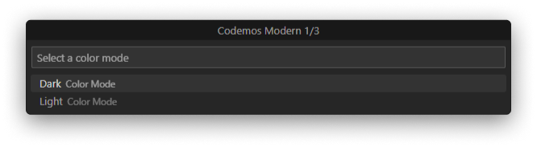
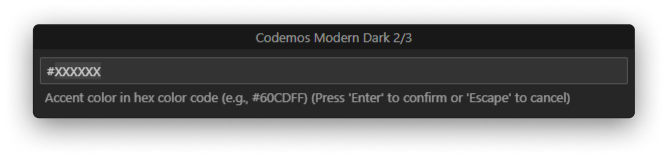
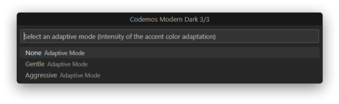
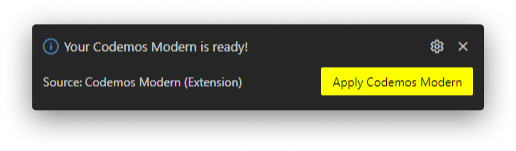
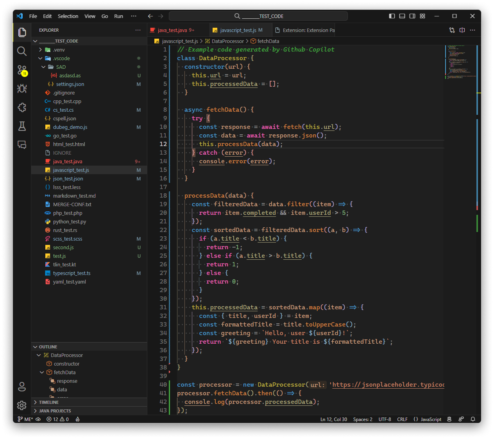
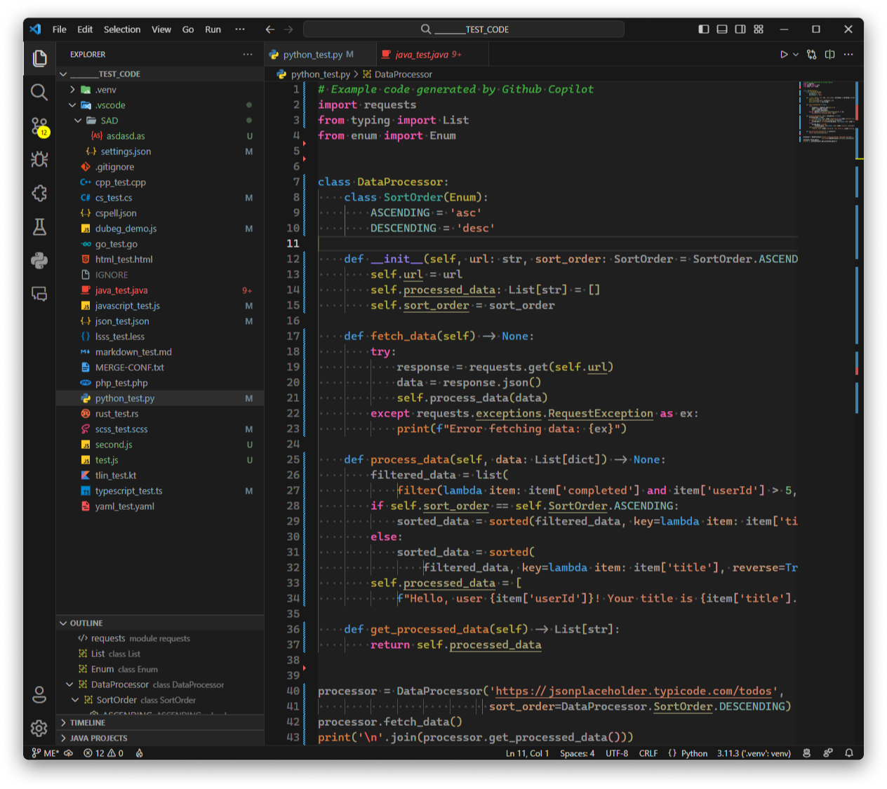
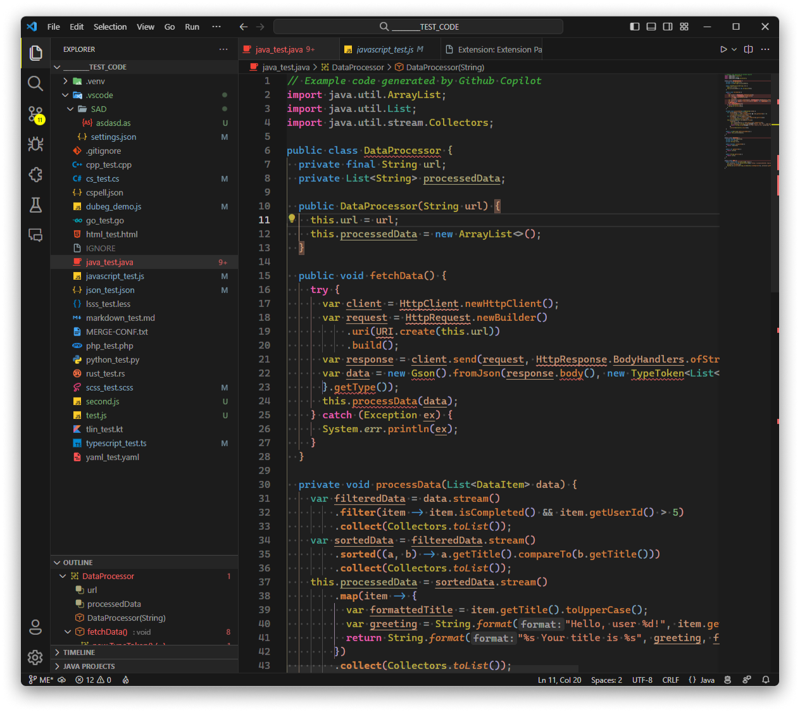
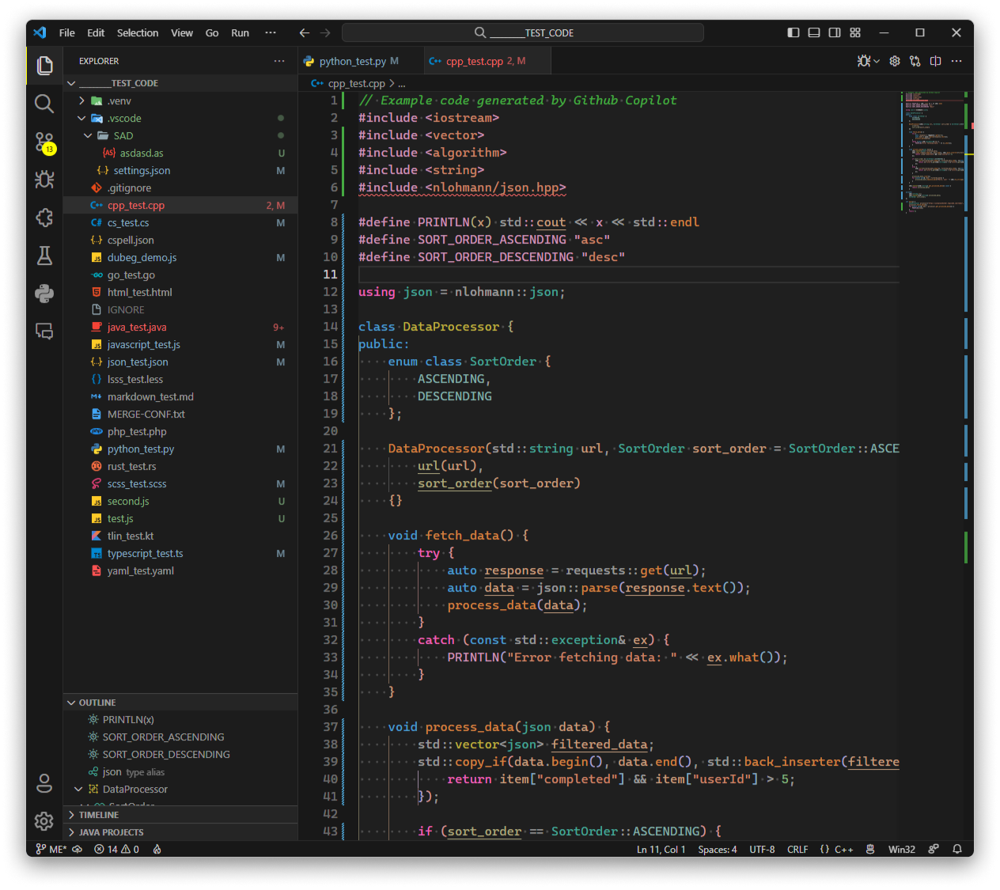
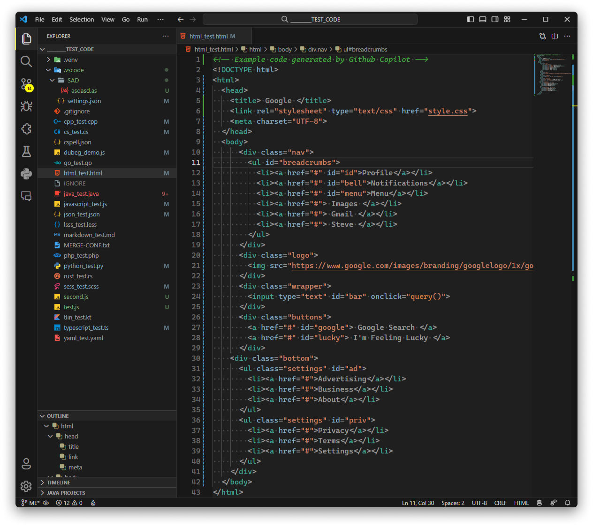
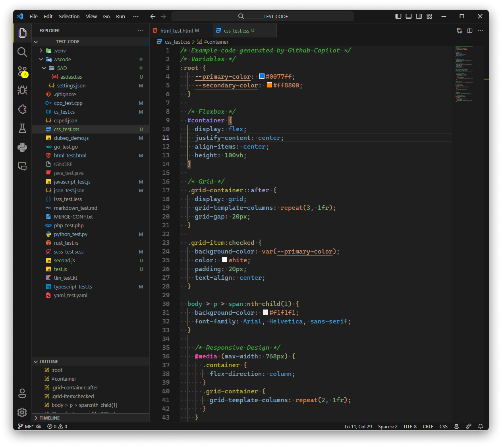

 

 

# **Codemos Modern**

Innovative, modern theme suite for VS Code

 

## 📚 Table of Contents

- [📖 About](#rdme-about)
- [📦 Installation](#rdme-install)
- [📝 Documentation](#rdme-doc)
- [🧩 Extensions](#rdme-ext)
- [📷 Screenshots](#rdme-ss)
- [📋 Change Log](#rdme-clog)
- [🙌🏼 Contribution](#rdme-contrib)
- [📜 License](#rdme-license)

 

<h2 id="rdme-about">📖 About</h1>

We at Codemos, are delighted to bring our most beloved theme family to [Visual Studio Code](https://code.visualstudio.com/). Just as VS Code redefined code editing, we're going to redefine how it should look.

Codemos Modern is a variant of the Codemos theme family. It is built from the ground up to be the best modern theme for VS Code. It gets its core principles from the Codemos design language and our [Modern theme principles](#modern-theme-principles).

 

> _Codemos Modern is designed to be the **only modern theme you would ever need** for your code editors._

 

### **Modern theme principles**

We built Codemos Modern with these fundamental principles:

- **Finest Quality:** As all of our themes, our modern theme should be of the highest quality. It should be well thought out and well designed. It should be a pleasure to use.
- **Unopinionated Design:** Our modern theme should stay neutral and not force a specific design language on the user. User should be able to make it their own.
- **Minimal:** Our modern theme should use the bare essentials to create a simple and uncluttered UI. It should not be distracting.
- **Consistent:** Our modern theme should provide a consistent experience across all of the UI. It should be consistent with the other Codemos variants.
- **Accessible:** Our modern theme should be accessible to everyone. It should be easy to read and easy to use.

 

<h2 id="rdme-install">📦 Installation</h1>

1. Open the **Extensions** sidebar in VS Code
1. Search for `Codemos Modern`
1. Click **Install**
1. Open the **Command Palette** with `Ctrl+Shift+P` or `⌘⇧P`
1. Select **Codemos Modern: Create Theme** and create your own Codemos Modern
1. When your theme is ready, click **Apply Codemos Modern** to apply it
1. Enjoy! 🎉

 

> **NOTE:** Read the [documentation](#rdme-doc) for learning how to use the command **Codemos Modern: Create Theme** and essential information about the Codemos Modern.

 

<h2 id="rdme-doc">📝 Documentation</h1>

In this section, you can find the documentation for the Codemos Modern.

- [Customization](#customization)
- [Adaptability](#adaptability)
- [Color and code intelligibility](#color-and-code-intelligibility)

 

### **Customization**

Codemos Modern provides three customization options through the command **Codemos Modern: Create Theme**.

 

> **NOTE:** You can activate command **Codemos Modern: Create Theme** from the **Command Palette**. See [Installation Section](#rdme-install) to learn how to do it.

 

1. **Color mode:** You can select which color mode your theme would use. (Dark/Light)

2. **Accent color:** You can select which accent color your theme would use. (Accent color determines the color of the important ui elements; buttons, badges, links, emphasized text, etc.)

> **NOTE:** You are required to provide an accent color which has at least a 4.5:1 ratio over black or white depending on the color mode you've selected. You can use [this awesome tool](https://contrast.tools/) to check the contrast ratio of your accent color.

 

3. **Adaptation Mode:** You can select which adaptation mode your theme would use. (Adaptation mode determines how much your accent color influence the rest of the UI. See [Adaptability Section](#adaptability) for more information.)

4. **Enjoy 🎉:** Click **Apply Codemos Modern** to apply your Codemos Modern.

### **Adaptability**

Adaptability mode is a unique feature of Codemos Modern. Before explaining the feature, we need to explain our motivation to create this feature.

With the launch of [Windows 11](https://www.microsoft.com/en-us/windows/windows-11), Microsoft introduced the [Mica material](https://learn.microsoft.com/en-us/windows/apps/design/style/mica) as a part of Windows 11's design system. Mica and its corresponding Apple counterpart [NSVisualEffectView](https://developer.apple.com/documentation/appkit/nsvisualeffectview) achieves the goal of making apps feel more in line with the operating system. Currently, VS Code doesn't provide these kinds of material.

There has been several attempts by the community to bring [glassmorphism](https://uxdesign.cc/glassmorphism-in-user-interfaces-1f39bb1308c9) to VS Code. An example extension which stands out is the [Vibrancy Continued](https://marketplace.visualstudio.com/items?itemName=illixion.vscode-vibrancy-continued) or the original, [Vibrancy](https://marketplace.visualstudio.com/items?itemName=eyhn.vscode-vibrancy). However, these extensions are not perfect. Because of the nature of VS Code, implementing a feature like this needs hacky solutions. These hacky solutions involve modifying/patching the VS Code installation, leaving you with a VS Code installation that is [unsupported](https://code.visualstudio.com/docs/supporting/FAQ#_installation-appears-to-be-corrupt-unsupported). These hacky solutions causes instabilities and UI inconsistences.

We at Codemos, wanted to create a solution that doesn't involve modifying/patching the VS Code installation and doesn't cause any unwanted consequences. We wanted to create a solution that is built into the theme itself. That's why we created the **Adaptability mode**.

 

#### How it works?

When creating your Codemos Modern, you are asked to select an Adaptability mode, see [Customization Section](#customization). Currently, there are three options to choose from; **None**, **Gentle** and **Aggressive**. We are planning to add more options in the future.

When you select an Adaptability mode other than **None**, a clever algorithm will be used to trick your eyes into thinking that the UI has transparency effects. This is done by using the accent color as the reference when calculating the opaque color of the UI elements. This way, the UI elements will adapt to your accent color and UI elements will look like they are letting the light pass through.

 

### Adaptability modes

- **None:** This is the default option. When you select this option, other UI elements such as background colors will not adapt to your accent color. This is the safest option.

- **Gentle:** This is the recommended option. When you select this option, other UI elements such as background colors will start to adapt to your accent color. This option is the most balanced option.

- **Aggressive:** This is the most extreme option. When you select this option, other UI elements such as background colors will adapt to your accent color as much as possible. This option is the most glassmorphism option.

> **NOTE:** We are currently monitoring this feature and planning to improve it in the future. If you have any suggestions, please [contribute](#rdme-contrib).

 

### **Color and code intelligibility**

Color is the essential part of code editing. Codemos Modern provides a carefully crafted color palette to make your code editing experience more intelligible and enjoyable.

Our color palette takes its foundations from the Visual Studio/Visual Studio Code color palette. We've made this classic color palette more modern and more accessible. We've also added some new colors to the palette to make it more complete. Every color has a **meaning** and is **consistent** across all the UI. While feeling familiar, it also feels fresh and modern.

Before we dive into color reference, we have one more contribution to code intelligibility. We used text decorations cleverly to give users more information about their code.

These decorations are:

- <del>Strike-through</del>: This decoration is used to indicate that the symbol is deprecated.
- <strong>Bold</strong>: This decoration is used to indicate that the symbol is abstract.
- <em>Italic</em>: This decoration is used to indicate that the symbol is static.
- <u>Underline</u>: This decoration is used to indicate that the symbol allows write access (not read-only).

 

> **NOTE:** Codemos Modern uses both **Semantic Highlighting** and **Syntax Highlighting**. Semantic Highlighting is a new version of token coloring with more capabilities and simplified tokenizing but not yet widely adopted by language extensions. See [Semantic Highlighting](https://code.visualstudio.com/api/language-extensions/semantic-highlight-guide) and [Syntax Highlighting](https://code.visualstudio.com/api/language-extensions/syntax-highlight-guide) for more information. We strongly recommend you to use a language extension that supports Semantic Highlighting. We are planning to add support for more languages in the future. Please [contribute](#rdme-contrib) if you want to help us.

 

 

<h2 id="rdme-ext">🧩 Extensions</h1>

We've also decided to theme some of the most used extensions to provide more consistent experience across the entire UI. In order an extension to be themed, it must [contribute themeable colors](https://code.visualstudio.com/api/references/contribution-points#contributes.colors). You can find the list of supported extensions that are themed in Codemos Modern. If your favorite extension is not on the list, visit [Codemos Modern's GitHub repository](https://github.com/Codemos-Inc/Codemos-Modern) and let us know!

### Supported Extensions

- [Error Lens](https://marketplace.visualstudio.com/items?itemName=usernamehw.errorlens)
- [GitHub Pull Requests and Issues](https://marketplace.visualstudio.com/items?itemName=GitHub.vscode-pull-request-github)
- [GitLens](https://marketplace.visualstudio.com/items?itemName=eamodio.gitlens)
- [Remote Repositories](https://marketplace.visualstudio.com/items?itemName=ms-vscode.remote-repositories)

 

<h2 id="rdme-ss">📷 Screenshots</h1>

In this section you can find how Codemos Modern looks and feels in most used languages.

- [JavaScript](#javascript)
- [Python](#python)
- [Java](#java)
- [C++](#cpp)
- [HTML](#html)
- [CSS](#css)

 

### JavaScript

### Python

### Java

### C++

### HTML

### CSS

 

<h2 id="rdme-clog">📋 Change Log</h1>

Changes from the last release. If you want to see the full change log, visit [CHANGELOG.md](https://github.com/Codemos-Inc/Codemos-Modern/blob/main/CHANGELOG.md).

### Added

- Ability to remember user theme configurations. After the version [1.1.0], user configurations will survive throughout updates.
- Theming support for the early [Diff Editor V2](https://github.com/microsoft/vscode/issues/184164) module.
- Theming support for [GitLens](https://marketplace.visualstudio.com/items?itemName=eamodio.gitlens) extension.
- Theming support for [Error Lens](https://marketplace.visualstudio.com/items?itemName=usernamehw.errorlens) extension.
- Theming support for [Remote Repositories](https://marketplace.visualstudio.com/items?itemName=ms-vscode.remote-repositories) extension.

### Changed

- Terminal colors to be more inline with other upcoming Codemos Modern releases.
- Theme created notification to feature a dismissive option for users that don't want to reload the VS Code window now.

### Fixed

- Inability to determine focused elements throughout the UI caused by `contrastBorder` and `contrastActiveBorder` theme attributes.
- UI shift caused by `window.activeBorder` and `window.inactiveBorder` theme attributes.

 

<h2 id="rdme-contrib">🙌🏼 Contribution</h1>

We are open to any kind of contribution. If you want to contribute to Codemos Modern, please join us on [GitHub](https://github.com/Codemos-Inc/Codemos-Modern).

 

<h2 id="rdme-license">📜 License</h1>

Codemos Modern is licensed under the [MIT License](https://github.com/Codemos-Inc/Codemos-Modern/blob/main/LICENSE.md).
