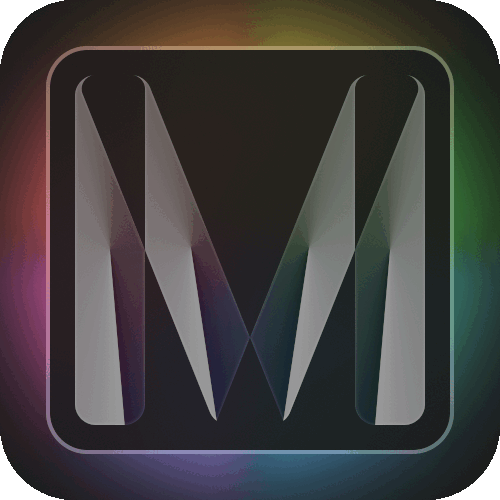
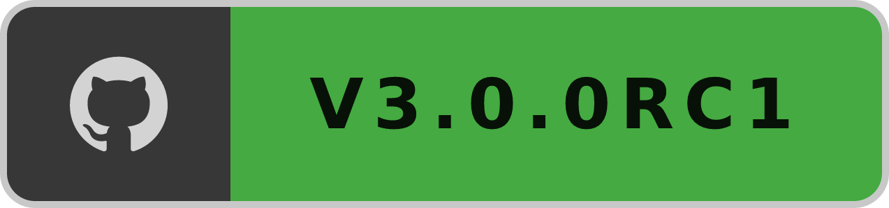
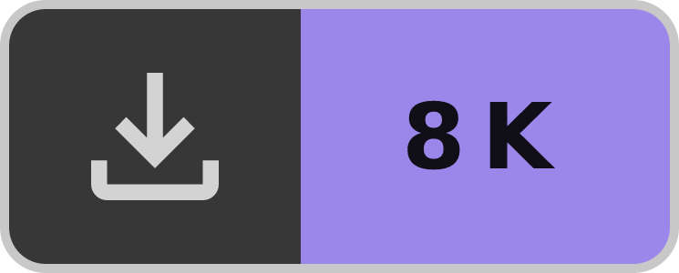
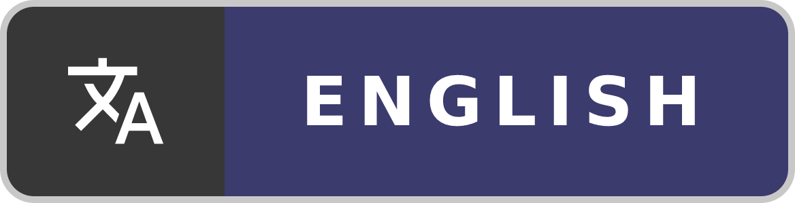
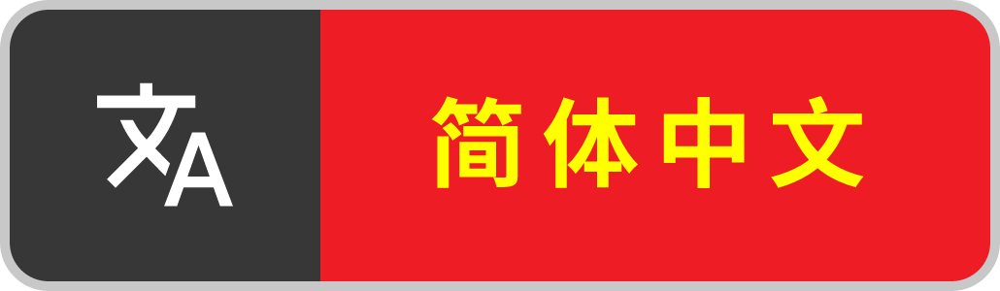
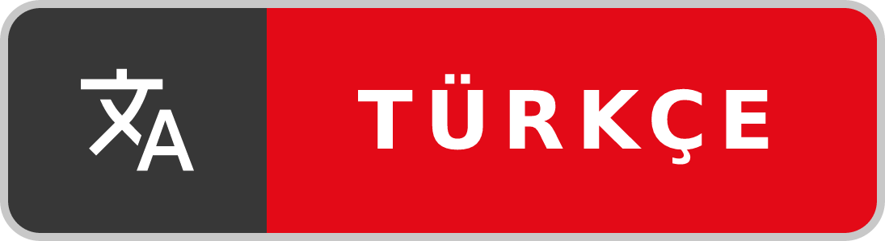

 

 

# **Codemos Modern**

&nbsp;
&nbsp;
&nbsp;
&nbsp;

Innovative, modern theme suite/hub for VS Code

&nbsp;
&nbsp;
&nbsp;
&nbsp;

## 📚 Table of Contents

- [📖 About](#rdme-about)
- [📦 Installation](#rdme-install)
- [📝 Documentation](#rdme-doc)
- [🧩 Extensions](#rdme-ext)
- [📷 Screenshots](#rdme-ss)
- [🌐 Localization](#rdme-locale)
- [📋 Change Log](#rdme-clog)
- [🙌🏼 Contribution](#rdme-contrib)
- [📜 License](#rdme-license)

 

<h2 id="rdme-about">📖 About</h2>

We at Codemos, are delighted to bring **Codemos Modern** to [Visual Studio Code](https://code.visualstudio.com/). Just as VS Code redefined code editing, we're going to redefine how it should look.

Modern released as an **innovative, modern theme suite for VS Code** but with the release of **V2**, it became **modular system that is highly customizable**. It also **became an hub** for the both first and third party themes to allow you to mix and match your favorite ones. Bundled themes designed with our [Modern theme principles](#modern-theme-principles) in mind.

 

> _Codemos Modern is designed to be the **only extension you would ever need** to configure VS Code's look._

 

### **Modern theme principles**

We built bundled themes with these fundamental principles:

- **Finest Quality:** As all of our themes, our modern theme should be of the highest quality. It should be well thought out and well designed. It should be a pleasure to use.
- **Unopinionated Design:** Our modern theme should stay neutral and not force a specific design language on the user. User should be able to make it their own.
- **Minimal:** Our modern theme should use the bare essentials to create a simple and uncluttered UI. It should not be distracting.
- **Consistent:** Our modern theme should provide a consistent experience across all of the UI. It should be consistent with Modern's other variants and designs.
- **Accessible:** Our modern theme should be accessible to everyone. It should be easy to read and easy to use.

 

<h2 id="rdme-install">📦 Installation</h2>

1. Open the **Extensions** sidebar in VS Code
1. Search for `Codemos Modern`
1. Click **Install**
1. Open the **Command Palette** with `Ctrl+Shift+P` or `⌘⇧P`
1. Find **Codemos Modern: Configure ⚙️** and configure your own Modern
1. When Modern is ready, click **Apply** to apply it
1. Enjoy! 🎉

 

> **NOTE:** Learn the basics about Codemos Modern and how to use **Codemos Modern: Configure ⚙️** by reading the [documentation](#rdme-doc).

 

<h2 id="rdme-doc">📝 Documentation</h2>

In this section, you can find the documentation for the Codemos Modern.

- [Configuration](#configuration)
- [Modularity](#modularity)
- [Adaptability](#adaptability)
- [Color and code intelligibility](#color-and-code-intelligibility)

 

### **Configuration**

Codemos Modern provides three configuration options through the command **Codemos Modern: Configure ⚙️**.

 

> **NOTE:** You can activate command **Codemos Modern: Configure ⚙️** from the **Command Palette**. See [installation section](#rdme-install) to learn how to do it.

 

1. **Variant:** You can select which variant your Modern will use. (Dark/Light)

2. **UI Theme:** You can select which UI theme your Modern will use. (Bundled/From Registries)

- **Bundled:** If you choose a bundled theme, there are additional configurations you can configure. See [modularity section](#modularity) for more information.

  1. **Design:** You can choose which design your Modern will use. (Design determines the overall look of the theme)
     
  2. **Accent color:** You can configure which accent color your theme will use. Accent color can be selected from Modern's excellent palette or you can provide a custom one with its hex color code. (Accent color determines the color of the important ui elements; buttons, badges, links, emphasized text, etc. and effects the adaptability mode)
     
  3. **Adaptation Mode:** You can select which adaptation mode your theme would use. (Adaptation mode determines how much your accent color influence the rest of the UI. See [adaptability section](#adaptability) for more information)
     

- **From Registries:** You can also choose an auxiliary theme. Auxiliary themes are the themes that are not bundled with Modern but can be installed from the auxiliary theme registries. Codemos provides a built-in registry that features some of the most popular themes. You can also create your own registries. See [modularity section](#modularity) for more information.

  1. **Auxiliary UI Theme:** You can select which auxiliary theme your Modern will use as the UI theme. (Auxiliary theme will be installed and activated automatically from the indicated registry)
     

3. **Code Theme:** You can select which code theme your Modern will use. (Code theme determines the colors of your codes)
   

- **Bundled:** We worked hard to make sure that our bundled code theme provides the best developer experience possible. (See [color and code intelligibility section](#color-and-code-intelligibility) for more information) However, if you want to use an auxiliary code theme, you can select **From Registries** option and choose a code theme from the registries.

- **From Registries:** You can also choose an auxiliary theme. Auxiliary themes are the themes that are not bundled with Modern but can be installed from the auxiliary theme registries. Codemos provides a built-in registry that features some of the most popular themes. You can also create your own registries. See [modularity section](#modularity) for more information.

  1. **Auxiliary Code Theme:** You can select which auxiliary theme your Modern will use as the code theme. (Auxiliary theme will be installed and activated automatically from the indicated registry)
     

4. **Enjoy 🎉:** When you are done with your configurations, you can click **Apply** to apply your Modern.

### **Modularity**

After the launch of **Codemos Modern V2** we've decided to make Modern more modular, giving our users more freedom to express themselves. In order to achieve that, we've decided to allow side-loading of third party themes.

#### How it works?

We've designed a system for installing and managing third party themes. This system consists of two elements. **Auxiliary theme registries** and **Auxiliary themes**. Auxiliary theme registries are GitHub repositories that are the databases for third party themes and auxiliary themes are the actual third party themes. More information can be found in [our official registry's docs](https://github.com/Codemos-Inc/Auxiliary-Theme-Registry).

By default, Modern comes with [our official registry](https://github.com/Codemos-Inc/Auxiliary-Theme-Registry), so you can benefit this system without any extra effort. However, you are not forced to use our official registry. You can use community registries or even create your own registries, _possibilities are endless_.

This system allows you to match your favorite themes to **create your own style**. You can also share your styles to the community.

#### How to side-load a theme?

You don't have to do anything special. Just add your favorite registry to your registries list (from the configuration `codemosModern.auxiliaryThemeRegistries` in the settings) and select your favorite theme from the command **Codemos Modern: Configure ⚙️**.

#### A little taste of modularity

**UI Theme:** [Cyberpunk](https://marketplace.visualstudio.com/items?itemName=max-SS.cyberpunk) | **Code Theme:** [Dracula Official](https://marketplace.visualstudio.com/items?itemName=dracula-theme.theme-dracula)

 

### **Adaptability**

Adaptability mode is a unique feature of Codemos Modern. Before explaining it, we first need to explain our motivation to create it.

With the launch of [Windows 11](https://www.microsoft.com/en-us/windows/windows-11), Microsoft introduced the [Mica material](https://learn.microsoft.com/en-us/windows/apps/design/style/mica) as a part of Windows 11's design system. Mica and its corresponding Apple counterpart [NSVisualEffectView](https://developer.apple.com/documentation/appkit/nsvisualeffectview) achieves the goal of making apps feel more in line with the operating system. Currently, VS Code doesn't provide these kind of materials.

There has been several attempts by the community to bring [glassmorphism](https://uxdesign.cc/glassmorphism-in-user-interfaces-1f39bb1308c9) to VS Code. An example extension which stands out is the [Vibrancy Continued](https://marketplace.visualstudio.com/items?itemName=illixion.vscode-vibrancy-continued) or the original, [Vibrancy](https://marketplace.visualstudio.com/items?itemName=eyhn.vscode-vibrancy). However, these extensions are not perfect. Because of the nature of VS Code, implementing a feature like this needs hacky solutions. These hacky solutions involve modifying/patching the VS Code installation, leaving you with a VS Code installation that is [unsupported](https://code.visualstudio.com/docs/supporting/FAQ#_installation-appears-to-be-corrupt-unsupported). These hacky solutions causes instabilities and UI inconsistences.

We at Codemos, wanted to create a solution that doesn't involve modifying/patching the VS Code installation and doesn't cause any unwanted consequences. We wanted to create a solution that is built into the theme itself. That's why we created the **Adaptability mode**.

#### How it works?

When creating your Codemos Modern, if you chose the bundled theme for your UI theme, you are asked to select an Adaptability mode, see [configuration section](#configuration). Currently, there are four options to choose from; **None**, **Gentle**, **Moderate** and **Aggressive**. When you select an Adaptability mode other than **None**, a clever algorithm will tint the UI colors based on your accent color, making you feel that the UI has transparency effects.

#### Adaptability modes

- **None:** When you select this option, UI elements such as background colors will not adapt to your accent color. This is the default option.

- **Gentle:** When you select this option, UI elements such as background colors will start to adapt to your accent color. If you want just a little taste of glassmorphism, this is the option for you.

- **Moderate:** When you select this option, UI elements such as background colors will adapt to your accent color. This option is the most balanced option.

- **Aggressive:** When you select this option, UI elements such as background colors will adapt to your accent color as much as possible. This option is the most extreme option.

 

### **Color and code intelligibility**

Color is the essential part of code editing. Codemos Modern provides a carefully crafted color palette to make your code editing experience more intelligible and enjoyable.

Our color palette takes its foundations from the original Visual Studio/Visual Studio Code color palette. We've made this classic color palette more modern and more accessible. We've also added some new colors to the palette to make it more complete. Every color has a **meaning** and is **consistent** across all the UI. While feeling familiar, it also feels fresh and modern.

Before we dive into color reference, we have one more contribution to code intelligibility. We used text decorations cleverly to give our users more information about their code.

These decorations are:

- <del>Strike-through</del>: This decoration is used to indicate that the symbol is deprecated.
- <strong>Bold</strong>: This decoration is used to indicate that the symbol is abstract.
- <em>Italic</em>: This decoration is used to indicate that the symbol is static.
- <ins>Underline</ins>: This decoration is used to indicate that the symbol allows write access (not read-only).

 

> **NOTE:** Codemos Modern uses both **Semantic Highlighting** and **Syntax Highlighting**. Semantic Highlighting is a new version of token coloring with more capabilities and simplified tokenizing but not yet widely adopted by language extensions. See [Semantic Highlighting](https://code.visualstudio.com/api/language-extensions/semantic-highlight-guide) and [Syntax Highlighting](https://code.visualstudio.com/api/language-extensions/syntax-highlight-guide) for more information. We strongly recommend you to use a language extension that supports Semantic Highlighting. We are planning to add support for more languages in the future. [Contribute](#rdme-contrib) if you want to help us.

 

 

<h2 id="rdme-ext">🧩 Extensions</h2>

We've also decided to theme some of the most used extensions to provide more consistent experience across the entire UI. In order an extension to be themed, it must [contribute themeable colors](https://code.visualstudio.com/api/references/contribution-points#contributes.colors). You can find the list of supported extensions that are themed in Codemos Modern below. If your favorite extension is not on the list, visit [Codemos Modern's GitHub repository](https://github.com/Codemos-Inc/Codemos-Modern) and let us know!

### Supported Extensions

- [Dart](https://marketplace.visualstudio.com/items?itemName=Dart-Code.dart-code)
- [Error Lens](https://marketplace.visualstudio.com/items?itemName=usernamehw.errorlens)
- [Flutter](https://marketplace.visualstudio.com/items?itemName=Dart-Code.flutter)
- [GitHub Pull Requests and Issues](https://marketplace.visualstudio.com/items?itemName=GitHub.vscode-pull-request-github)
- [GitLens](https://marketplace.visualstudio.com/items?itemName=eamodio.gitlens)
- [Material Icon Theme](https://marketplace.visualstudio.com/items?itemName=PKief.material-icon-theme)
- [Remote Repositories](https://marketplace.visualstudio.com/items?itemName=ms-vscode.remote-repositories)

 

<h2 id="rdme-locale">🌐 Localization</h2>

We try to make Codemos Modern the most accessible theming extension for VS Code. That's why we are planning to localize Codemos Modern to as many languages as possible. In this cause we need your help the most. Below, you can find the localization table. In this table you can see the status of the localization for each language. We are looking for volunteers to help us localize Codemos Modern. If you want to help us, join us on [GitHub](https://github.com/Codemos-Inc/Codemos-Modern).

> **NOTE:** Native speakers can help us by reviewing localizations with the status "💬". There are two files to check: `l10n/bundle.l10n.{locale}.json` and `package.nls.{locale}.json`.

### Localization Table

| Display Language    | Locale | Status | Released With | Maintainer | Notes                      |
| ------------------- | ------ | ------ | ------------- | ---------- | -------------------------- |
| English             | en     | 🟢     | v1.0.0        | Codemos    | -                          |
| Turkish             | tr     | 🟢     | v2.4.0        | Codemos    | -                          |
| Simplified Chinese  | zh-cn  | 🟢     | v2.4.0        | Codemos    | -                          |
| Japanese            | ja     | 💬     | v2.5.0        | Codemos    | Review needed              |
| Spanish             | es     | 🟢     | v2.5.0        | Codemos    | -                          |
| Russian             | ru     | 🟡     | -             | Codemos    | Will be released by v2.6.X |
| Portuguese (Brazil) | pt-br  | 🟡     | -             | Codemos    | Will be released by v2.6.X |
| French              | fr     | 🔴     | -             | -          | Planned for v2.7.X         |
| Korean              | ko     | 🔴     | -             | -          | Planned for v2.7.X         |
| German              | de     | 🔴     | -             | -          | Planned for v2.7.X         |
| Traditional Chinese | zh-tw  | 🔴     | -             | -          | Planned for v2.8.X         |
| Italian             | it     | 🔴     | -             | -          | Planned for v2.8.X         |
| Polish              | pl     | 🔴     | -             | -          | Not planned                |
| Hungarian           | hu     | 🔴     | -             | -          | Not planned                |
| Czech               | cs     | 🔴     | -             | -          | Not planned                |
| Bulgarian           | bg     | 🔴     | -             | -          | Not planned                |

 

<h2 id="rdme-ss">📷 Screenshots</h2>

In this section you can find how Codemos Modern looks and feels in most used languages.

- [JavaScript](#javascript)
- [Python](#python)
- [Java](#java)
- [C++](#cpp)
- [HTML](#html)
- [CSS](#css)
- [JSON](#json)

 

### JavaScript

### Python

### Java

<h3 id="cpp">C++</h3>

### HTML

### CSS

### JSON

 

<h2 id="rdme-clog">📋 Change Log</h2>

Changes from the last major release shown below. If you want to see the full change log, visit [CHANGELOG.md](https://github.com/Codemos-Inc/Codemos-Modern/blob/main/CHANGELOG.md).

### Added

- VS Code v1.86.x support.
- Modularity system. Users can now side-load **third party themes**.
- Brand new design, **"Minimal"**. Users can now choose between **"Modern"** and **"Minimal"** designs.
- Command `codemosModern.authenticate` to increase GitHub **api rate limits**.
- Set of configurations to customize the text decorations on symbols. (Only bundled themes are effected)

### Fixed

- Material Icon Theme icons not correctly themed.
- Multiple update requests to recompile themes.

### Changed

- Command `codemosModern.configure` to be more clear an use the new `QuickPickItem` api for custom icons.

 

<h2 id="rdme-contrib">🙌🏼 Contribution</h2>

We are open to any kind of contribution. If you want to contribute to Codemos Modern, join us on [GitHub](https://github.com/Codemos-Inc/Codemos-Modern).

 

<h2 id="rdme-license">📜 License</h2>

Codemos Modern is licensed under the [MIT License](https://github.com/Codemos-Inc/Codemos-Modern/blob/main/LICENSE.md).
